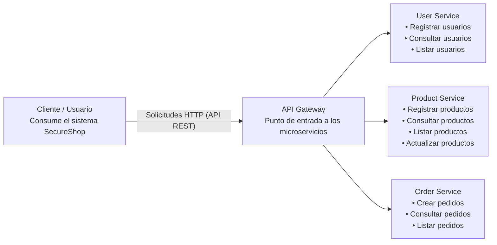

# Actividad de Aprendizaje: Reconocimiento de activo

| **Departamento:** | Ciencias de la Computación | **Carrera:** | Software |
|---|---|---|---|
| **Asignatura:** | Software Seguro | **Nivel:** | 7mo |
| **Docente:** | Ing. Ángel Cudco | **Tarea N°:** | 1 |
| **Fecha:** | 29/09/2026 | **Calificación:** | |

**Integrantes:**

- Zaith Alejandro Manangón Vinueza
- Stefany Maricela Díaz Antun
- Andrés Isaias Cedeño Cuenca

---

## Antecedentes

### Arquitectura de Microservicios - SecureShop

**SecureShop** es una empresa *ficticia* dedicada a la comercialización de productos tecnológicos a través de Internet. Debido al crecimiento de sus operaciones, requiere desarrollar una nueva plataforma web que permita administrar usuarios, productos y pedidos.

La empresa ha decidido construir la solución utilizando una arquitectura basada en microservicios, debido a que desea que sus componentes puedan desarrollarse, desplegarse y evolucionar independientemente.

El equipo de desarrollo deberá construir progresivamente una primera versión de la aplicación SecureShop, compuesta por servicios independientes para la administración de usuarios, productos y pedidos, una base de datos para cada dominio y un punto de entrada común para las solicitudes de los clientes.

Paralelamente al desarrollo funcional, el equipo deberá analizar los aspectos de seguridad que aparecen durante el ciclo de vida del software, identificando activos, vulnerabilidades potenciales, amenazas, riesgos, propiedades de seguridad, puntos de exposición y dependencias entre los diferentes componentes.

---

## Desarrollo

### Actividad 1

1. Crear un repositorio de GitHub.
2. Identificar al menos diez activos de SecureShop. Por ejemplo:
   - Información de usuarios
   - Credenciales
   - Catálogo de productos
3. Clasificar cada activo según:
   - información;
   - software;
   - servicio;
   - infraestructura;
   - datos.
4. Responder: ¿Qué consecuencias tendría para SecureShop que este activo fuera accedido, modificado o quedara indisponible?

| N. | Activo | Tipo | Consecuencia de acceso, modificación o indisponibilidad |
|---|---|---|---|
| 1 | Información de un Pedido | Información | Se expone el historial de compras y las direcciones de clientes; se pueden alterar los mismos (montos, cantidades, destino), lo que deriva en fraude y pérdidas económicas. |
| 2 | Logs y registros de auditoría | Datos | Pueden filtrar tokens, IPs o datos personales si se registran de más; con un atacante se puede perder evidencia forense. |
| 3 | API Gateway | Servicio | Es el punto de entrada único: un fallo de control permite llegar a todos los microservicios. Si quedara fuera de servicio, toda la plataforma queda caída. |
| 4 | Microservicios | Servicio | Con operaciones sin autenticación, funciones como "listar usuarios" quedan expuestas a cualquiera. Si llega a ser modificado, la lógica de negocio se altera. Si queda indisponible, se pierde la función de ese dominio (ej.: sin Product Service no se pueden completar ni crear los pedidos). |
| 5 | Base de datos de productos | Datos | Se expone el inventario y el catálogo completo; puede haber registros corruptos o productos a precios incorrectos; Product Service no responde. |
| 6 | Variables de entorno | Información sensible | Acceso directo a la base de datos con la posibilidad de generar montos y perfiles falsos. |
| 7 | Respaldos | Datos | Filtración masiva, ya que es una copia completa de todo; se podría restaurar un backup modificado con datos corruptos. |
| 8 | Red y canales de comunicación | Infraestructura | Intercepción de tráfico sobre HTTP, peticiones y respuestas alteradas en tránsito. Los servicios no logran comunicarse entre sí. |
| 9 | Base de datos de usuarios | Datos | Si se accediera a los datos, existiría filtración de todo el padrón de clientes junto con los hashes. Si se modificara, quedarían registros corruptos o cuentas inyectadas. Si quedara indisponible, el User Service caería junto con el login y el registro. |
| 10 | Código fuente (repositorio GitHub) | Software | Con el acceso al software se revelaría la lógica y las posibles vulnerabilidades. Si existen modificaciones, podría haber inyección de backdoors o código malicioso en el despliegue. Al quedar indisponible no se podría corregir, desplegar ni evolucionar el sistema. |
| 11 | Servidores / contenedores / nube donde se despliega | Infraestructura | Si se accede como root sin autorización se podría perder el control de todos los servicios y BD. Si se modificara la infraestructura, su configuración quedaría alterada con malware o minería de criptomonedas. Al quedar indisponible habría caída total del sistema. |
| 12 | Credenciales (contraseñas hasheadas, tokens de sesión/JWT) | Información | Al acceder a la información existiría suplantación de identidad, secuestro de cuentas y compras fraudulentas. Al haber modificación, alguien podría tomar el control de cuentas o escalar privilegios (volverse admin). Al quedar indisponible, nadie podría iniciar sesión y el sistema quedaría inutilizable. |
| 13 | Base de datos de pedidos | | |
| 14 | Servicio de pedidos (Order Service) | Software / Servicio | Si se accediera sin autorización al Order Service, un atacante podría consultar o manipular pedidos de otros clientes. Si se modificara su lógica, podría alterar el proceso de compra, por ejemplo, permitiendo crear pedidos sin realizar correctamente las validaciones. Si quedara indisponible, los clientes no podrían realizar ni consultar sus pedidos. |
| 15 | Información de pagos e integración con la pasarela de pagos | Información sensible | Si es accedida, se puede usar esa información para hacer fraude masivo; si queda indisponible no se podría cobrar y los pedidos quedarían sin pagar. |

---

## Actividad en clase

Añadir activos hasta sumar 15, a cada activo identificar 3 amenazas y a cada amenaza al menos un mecanismo de mitigación.

| N. | Activo | Amenaza | Mitigación |
|---|---|---|---|
| 1 | Información de un Pedido | 1. Un usuario consulta pedidos de otros cambiando el ID en la URL. 2. Manipulación de montos, cantidades o destino antes de confirmar el pedido. 3. Exposición de datos personales en respuestas o errores. | 1. Validar en cada petición que el pedido pertenezca al usuario autenticado. 2. Recalcular precios y totales en el servidor, no usar valores enviados por el cliente. 3. Devolver solo los campos necesarios (DTOs) y cifrar datos sensibles en reposo. |
| 2 | Logs y registros de auditoría | 1. Datos sensibles escritos en los logs. 2. Registro insuficiente de eventos de seguridad. 3. Borrado o alteración de logs por un atacante. | 1. Enmascarar o redactar campos sensibles en el logger y definir una política de qué se registra y qué no. 2. Definir los eventos de seguridad que se deben registrar, un correlation ID generado en el gateway y alertas para eventos críticos. 3. Centralizar los logs en un servidor separado (ELK, Loki), almacenamiento de solo escritura y una alerta si un servicio deja de enviar logs. |
| 3 | API Gateway | 1. Ataque de denegación de servicio (DDoS). 2. Bypass del gateway (acceso directo a los microservicios). 3. Configuración incorrecta de CORS o de rutas. | 1. Rate limiting, CDN/WAF con protección anti-DDoS (por ejemplo, Cloudflare), varias instancias del gateway y autoescalado. 2. Microservicios solo en la red interna (únicamente el gateway expuesto) y validación del token también en cada servicio (zero trust). 3. Lista blanca de orígenes permitidos, revisión de las rutas expuestas y política de denegar por defecto. |
| 4 | Microservicios (User / Product / Order) | 1. Endpoints sin autenticación o autorización. 2. Fallo en cascada entre servicios. 3. Suplantación de un servicio interno. | 1. Guards de autenticación y roles en cada endpoint (AuthGuard + RolesGuard en NestJS) con política de denegar por defecto. 2. Timeouts, reintentos con backoff, circuit breaker y health checks para retirar las instancias que fallan. 3. TLS entre servicios, propagación del JWT firmado en lugar de encabezados simples y validación en cada servicio. |
| 5 | Base de datos de productos | 1. Borrado o corrupción del catálogo. 2. Inconsistencia de stock por condiciones de carrera. 3. Denegación de servicio por consultas costosas. | 1. Consultas parametrizadas, borrado lógico (soft delete), backups automáticos con recuperación a un punto en el tiempo (PITR). 2. Transacciones con bloqueo optimista o actualización atómica y reserva de stock al crear el pedido. 3. Índices, paginación obligatoria, timeouts de consulta y caché (por ejemplo, Redis) para los productos más vistos. |
| 6 | Variables de entorno | 1. Secretos subidos accidentalmente al repositorio (.env en GitHub). 2. Lectura de secretos por un atacante con acceso al servidor o contenedor. 3. Credenciales débiles, compartidas o que nunca se rotan. | 1. Agregar .env al .gitignore y usar escaneo de secretos. 2. Gestor de secretos (Vault, AWS Secrets Manager, Docker secrets) con permisos mínimos. 3. Rotación periódica, credenciales distintas por servicio y por entorno. |
| 7 | Respaldos | 1. Robo o filtración de un respaldo completo. 2. Restauración de un respaldo manipulado o corrupto. 3. Ransomware que cifra o elimina también los respaldos. | 1. Cifrar los respaldos y restringir su acceso con controles de identidad. 2. Verificar integridad con hashes/firmas antes de restaurar. 3. Copias offline o inmutables y regla 3-2-1 (3 copias, 2 medios, 1 externa). |
| 8 | Red y canales de comunicación | 1. Interceptación de tráfico man-in-the-middle por usar HTTP. 2. Escaneo y acceso a puertos o servicios internos expuestos. 3. Suplantación o alteración de peticiones en tránsito. | 1. Forzar HTTPS/TLS 1.2+ y HSTS; mTLS entre servicios. 2. Segmentación de red, firewalls y exponer solo el puerto del gateway. 3. Tokens con expiración corta, nonces/timestamps y firmas en mensajes críticos. |
| 9 | Base de datos de usuarios | 1. Un atacante introduce código SQL en el inicio de sesión o registro para consultar datos de otros usuarios. 2. Una persona intenta conectarse al puerto de la BD sin pasar por el User Service. 3. Un atacante con acceso a la BD modifica roles o datos de usuarios para crear una cuenta administrativa. | 1. Utilizar consultas parametrizadas/ORM y validar las entradas recibidas antes de enviarlas a la base de datos. 2. Mantener la BD en una red privada, bloquear conexiones externas mediante firewall y permitir acceso únicamente desde el User Service. 3. Aplicar mínimo privilegio, separar permisos de lectura/escritura y registrar mediante auditoría los cambios realizados sobre usuarios. |
| 10 | Código fuente (repositorio GitHub) | 1. Un atacante obtiene las credenciales de un desarrollador y accede al código de SecureShop. 2. Alguien incorpora una modificación que contiene una puerta trasera o código malicioso. 3. Un desarrollador sube accidentalmente contraseñas, tokens o claves de acceso a la base de datos. | 1. Utilizar MFA, contraseñas seguras y revisar periódicamente los permisos de los colaboradores. 2. Implementar revisión obligatoria de Pull Requests, protección de ramas y análisis automático del código antes de aceptar cambios. 3. Utilizar gestión de secretos y variables de entorno, además de herramientas de detección de secretos antes de permitir el push. |
| 11 | Servidores / contenedores / nube donde se despliega | 1. Un atacante intenta acceder al servidor donde están desplegados los microservicios. 2. Uno de los microservicios utiliza una imagen con una vulnerabilidad conocida que permite ejecutar código dentro del contenedor. 3. Un atacante que comprometa un microservicio intenta obtener privilegios sobre el servidor anfitrión. | 1. Utilizar llaves SSH, MFA cuando esté disponible, firewall y restricción del acceso SSH únicamente a direcciones autorizadas. 2. Mantener las imágenes actualizadas, escanearlas antes del despliegue y utilizar imágenes mínimas y confiables. 3. Ejecutar los contenedores con mínimos privilegios, evitar root, limitar capacidades y aislar adecuadamente los contenedores. |
| 12 | Credenciales (contraseñas hasheadas, tokens de sesión/JWT) | 1. Un atacante obtiene un token de sesión válido y lo utiliza para entrar a la cuenta de otro usuario. 2. Un atacante prueba numerosas contraseñas hasta obtener acceso a una cuenta. 3. Un atacante intenta modificar información del token para obtener el rol de administrador. | 1. Utilizar tokens de corta duración, HTTPS y almacenamiento seguro de tokens, además de mecanismos de revocación cuando sean necesarios. 2. Implementar limitación de intentos (rate limiting), bloqueo temporal y políticas de contraseñas seguras. 3. Validar siempre la firma del JWT en el servidor y comprobar que el usuario tenga realmente el permiso solicitado antes de ejecutar operaciones administrativas. |
| 13 | Base de datos de pedidos | 1. Un atacante intenta enviar solicitudes directamente al microservicio para evitar los controles del API Gateway. 2. Un cliente modifica parámetros de la solicitud para cambiar la cantidad, precio o usuario asociado al pedido. 3. Un atacante automatiza solicitudes para generar cientos de pedidos y saturar el servicio o generar información fraudulenta. | 1. Implementar autenticación y autorización también dentro del microservicio, además de restringir la comunicación externa al API Gateway. 2. Realizar validaciones del lado del servidor y obtener el precio y usuario desde fuentes confiables, sin confiar en valores enviados directamente por el cliente. 3. Implementar rate limiting, validación de autenticación y controles de frecuencia por usuario/IP, además de monitorear solicitudes anómalas. |
| 14 | Servicio de pedidos (Order Service) | 1. Acceso sin autorización para consultar o manipular pedidos de otros. 2. Creación de pedidos con datos inválidos o manipulados. 3. Indisponibilidad por sobrecarga o fallo de un servicio del que depende. | 1. Autenticación con JWT y verificación de propiedad del recurso. 2. Validar stock, precios y usuario contra User y Product Service en el servidor. 3. Timeouts, circuit breaker, reintentos controlados y rate limiting. |
| 15 | Información de pagos e integración con la pasarela de pagos | 1. Confirmación de pago falsificada (webhook falso). 2. Almacenamiento de datos de tarjeta (número, CVV) en sistemas propios. 3. Fraude con tarjetas robadas / card testing. | 1. Verificar la firma HMAC de cada webhook, confirmar el estado de la transacción consultando la API de la pasarela desde el servidor y procesar cada notificación una sola vez (idempotencia). 2. No almacenar nunca datos de tarjeta: usar la tokenización o el checkout alojado de la pasarela (Payphone, Kushki, Stripe), de modo que el número nunca pase por los servidores de SecureShop. 3. 3-D Secure, las herramientas antifraude de la pasarela, rate limiting y CAPTCHA en el checkout, y límites de intentos por cuenta. |
